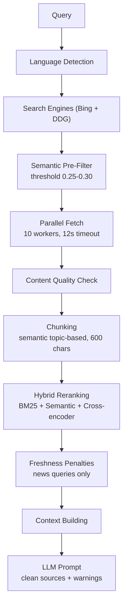

<p align="center">
  
</p>

<p align="center">
  <strong>Free Perplexity-style search for local sLLM</strong>
</p>

A library for building search pipelines for local LLMs that produce Perplexity-style answers, but self-hosted and without API costs or limits.

Searches Bing + DuckDuckGo, filters noise before fetching, extracts clean content, reranks by relevance, and outputs a complete LLM-ready prompt with inline citations. Plug it into Ollama, LM Studio, or any LLM API and get cited, structured answers from the internet.

[](https://www.python.org/downloads/)
[](https://github.com/KazKozDev/production_rag_pipeline/actions/workflows/ci.yml)
[](LICENSE)
[](https://www.sbert.net/)
[](#how-it-works)


## Table of Contents

<table>
  <tr>
    <td><a href="#how-it-works">How It Works</a></td>
    <td><a href="#key-features">Key Features</a></td>
    <td><a href="#package-overview">Package Overview</a></td>
    <td><a href="#requirements">Requirements</a></td>
  </tr>
  <tr>
    <td><a href="#installation">Installation</a></td>
    <td><a href="#quick-start">Quick Start</a></td>
    <td><a href="#output-example">Output Example</a></td>
    <td><a href="#public-api">Public API</a></td>
  </tr>
  <tr>
    <td><a href="#example-pipeline-usage">Example Pipeline Usage</a></td>
    <td><a href="#configuration">Configuration</a></td>
    <td><a href="#design-notes">Design Notes</a></td>
    <td><a href="#development">Development</a></td>
  </tr>
</table>

## How It Works




## Key Features

### Dual Search Engines

Bing + DuckDuckGo searched in parallel, results merged with position-based scoring. Bing works well for financial/factual queries, DDG gives free access and a news mode. When the pipeline detects news-related keywords (`новост`, `news`, `latest`, etc.), DDG switches to its News index — returns actual articles instead of homepages.

### Semantic Pre-Filtering

Each search result is checked for relevance **before** the page is fetched. Cosine similarity between query and title+snippet embeddings, threshold 0.25 (RU) / 0.30 (EN). In practice, 11 out of 20 results get dropped pre-fetch — saves about 6 seconds.

Example: query "LLM agents news" — `flutrackers.com` (sim=0.12) filtered, `llm-stats.com` (sim=0.68) fetched.

### Context-Aware Content Detection

Two-stage check for price lists and tables. First structural: does >30% of lines look like numbers? Then semantic: is this price list actually relevant? This way `cbr.ru` exchange rates pass for a "курс евро" query (sim=0.75) but `steamcommunity.com` CS:GO prices get rejected (sim=0.05). No hardcoded domain whitelists.

### Freshness Tracking

Activated only for news queries (auto-detected via keyword patterns). Content older than 30 days gets −2 to confidence score, older than 7 days gets −1. Outdated sources are flagged in the LLM prompt with exact age. Non-news queries (prices, how-to) are unaffected.

### Multilingual Intelligence

Auto-detects language by Cyrillic character ratio (10% threshold) and switches models accordingly. Russian queries get `paraphrase-multilingual-MiniLM-L12-v2` for embeddings and a multilingual cross-encoder (13 languages). English queries get the faster `all-MiniLM-L6-v2`. Models download automatically on first run.

### Quality Control

Failed fetches excluded from context. Boilerplate, navigation, ads, and newsletter patterns filtered. Citation numbers always match actual sources — no phantom `[4]`, `[5]` references when only 3 sources exist.

<p align="center">
  
</p>

## Package Overview

The package is structured as a library first:

- `production_rag_pipeline.search`
  Bing/DDG search, result merging, language filtering
- `production_rag_pipeline.fetch`
  HTTP client, retries, parallel page fetching
- `production_rag_pipeline.extract`
  content extraction, publish-date parsing, chunking, quality filtering
- `production_rag_pipeline.rerank`
  BM25, semantic relevance, answer-span detection, MMR, cross-encoder reranking
- `production_rag_pipeline.pipeline`
  end-to-end orchestration: search → fetch → extract → rerank → context
- `production_rag_pipeline.prompts`
  final LLM prompt assembly
- `production_rag_pipeline.core`
  internal runtime settings and optional dependency state

The pipeline is designed to degrade gracefully:

- without semantic models, lexical ranking still works
- without `trafilatura`, extraction falls back to `BeautifulSoup`
- configuration can come from dataclasses, YAML, or environment variables


## Requirements

- Python 3.8+
- macOS, Linux, or Windows for the Python package itself
- internet access for live search and page fetching
- optional model downloads on first semantic run (`sentence-transformers`)
- optional Hugging Face token for higher model download rate limits

If you use only the base install, the pipeline still works with lexical fallbacks. Semantic reranking and richer extraction become available when optional extras are installed.


## Installation

```bash
git clone https://github.com/KazKozDev/production_rag_pipeline.git
cd production_rag_pipeline
pip install .
```

Optional extras:

```bash
pip install .[extraction]
pip install .[semantic]
pip install .[full]
```

Profiles:

- `base`: `beautifulsoup4`, `curl-cffi`, `PyYAML`
- `extraction`: adds `trafilatura`
- `semantic`: adds `sentence-transformers`, `scikit-learn`, `numpy`
- `full`: installs both optional groups


## Quick Start

```python
from production_rag_pipeline import build_llm_prompt

prompt = build_llm_prompt("latest AI news", lang="en")
print(prompt)
```

CLI:

```bash
production-rag-pipeline "latest AI news"
production-rag-pipeline "Bitcoin price" --mode search
production-rag-pipeline "новости ИИ" --mode read --lang ru
```

macOS launcher:

```bash
./run_llm_query.command
```

The launcher bootstraps `.venv` automatically and installs missing dependencies on first run, so it is a convenient entry point for local manual testing on macOS.


## Output Example

Example of the generated prompt shape:

<details>
<summary>Expand library-generated prompt example for the query `bitcoin rate`</summary>

This is an example of the final prompt text produced by the Python library for the query `курс биткоина` before you send it to a local LLM.

```text
CURRENT DATE: 2026-03-18 20:06:44 (Wednesday)
WRITING REQUIREMENTS:
1. Use only the provided sources.
2. Organize the answer with clear `##` headings.
3. Cite every factual claim with `[N]`.
4. For news queries, prioritize sources from the last 7 days.
5. If sources conflict, describe both versions clearly.
6. Include concrete details: dates, names, numbers, prices, locations, and percentages when available.
7. Use all relevant sources instead of relying on only one or two.
8. End with `## Источники:` and list the sources actually used.

QUALITY SIGNALS FROM THE PIPELINE:
- Context chunks: 8
- Unique sources: 2
- Unique domains: 4
- Chunks with factual data: 3
- Chunks with explicit dates: 3

QUERY PROFILE:
- Type: Factual/Brief
- Intent: Get current price/rate with market data
- Expected answer shape: 1-2 paragraphs
- Critical attributes: freshness (< 24h preferred), numerical accuracy, source credibility

QUESTION: bitcoin rate

SOURCES:
[1] Bitcoin price today, BTC to USD live price, marketcap and chart ...
ounts of coins via regular mining: Satoshi Nakamoto alone is believed to own over a million Bitcoin.
Mining Bitcoins can be very profitable for miners, depending on the current hash rate and the price of Bitcoin. While the process of mining Bitcoins is complex, we discuss how long it takes to mine one Bitcoin on CoinMarketCap Alexandria — as we wrote above, mining Bitcoin is best understood as how long it takes to mine one block, as opposed to one Bitcoin. As of mid-September 2021, the Bitcoin mining reward is capped to 6.25 BTC after the 2020 halving , which is roughly $299,200 in Bitcoin price today.
Please wait a moment.
Please wait a moment.
Disclaimer: This page may contain affiliate links. CoinMarketCap may be compensated if you visit any affiliate links and you take certain actions such as signing up and transacting with these affiliate platforms. Please refer to Affiliate Disclosure
Bitcoin Market Cycles
Bitcoin Treasury Holdings
What Is Bitcoin (BTC)?
Bitcoin is a decentralized cryptocurrency originally described in a 2008 whitepaper by a person, or group of people, using the alias Satoshi Nakamoto . It was launched soon after, in January 2009.
ard is capped to 6.25 BTC after the 2020 halving , which is roughly $299,200 in Bitcoin price today.
How Is the Bitcoin Network Secured?
What Is Bitcoin’s Role as a Store of Value?

[2] Bitcoin Price: BTC Live Price Chart, Market Cap & News Today | CoinGecko
have a disproportionate effect, causing the price to move more sharply than in more liquid markets.
Macroeconomic Sensitivity: As Bitcoin has become a mainstream asset, its price has become increasingly sensitive to global macroeconomic factors, such as interest rate decisions by central banks, inflation data, and geopolitical events.
Macroeconomic Sensitivity: As Bitcoin has become a mainstream asset, its price has become increasingly sensitive to global macroeconomic factors, such as interest rate decisions by central banks, inflation data, and geopolitical events.
xed supply ensures no central authority can inflate the supply or devalue the holdings of its users.
This scarcity is programmatically reinforced by the Bitcoin Halving , which systematically reduces the rate of new Bitcoin issuance, making it progressively scarcer over time as demand grows.
The deflationary economic model contrasts sharply with inflationary fiat currencies. As demand grows while supply remains fixed and decreasing, basic economics suggests upward price press
factors, such as interest rate decisions by central banks, inflation data, and geopolitical events.
What Makes Bitcoin Valuable?
Bitcoin's value stems from solving the double-spending problem without trusted intermediaries, creating the first truly scarce digital asset with a fixed supply cap of 21 million coins enforced by transparent, unchangeable code.


References:
  [1] Bitcoin price today, BTC to USD live price, marketcap and chart ... — https://coinmarketcap.com/currencies/bitcoin/
  [2] Bitcoin Price: BTC Live Price Chart, Market Cap & News Today | CoinGecko — https://www.coingecko.com/en/coins/bitcoin

ANSWER FORMAT:
[Detailed answer with inline citations]

## Источники:
[1] Source Title — URL
[2] Another Source — URL
```

</details>

The final output is designed to be dropped directly into a local LLM, preserving source grounding and a strict citation format.


## Public API

High-level API:

```python
from production_rag_pipeline import (
    build_llm_context,
    build_llm_prompt,
    search_and_read,
    search_extract_rerank,
)
```

Module-level API:

```python
from production_rag_pipeline.search import search, search_bing, search_ddg
from production_rag_pipeline.fetch import fetch_pages_parallel
from production_rag_pipeline.extract import extract_content, chunk_text
from production_rag_pipeline.rerank import rerank_chunks
from production_rag_pipeline.pipeline import search_extract_rerank, build_llm_context
from production_rag_pipeline.prompts import build_llm_prompt
```

## Example Pipeline Usage

```python
from production_rag_pipeline.pipeline import build_llm_context, search_extract_rerank

chunks, results, fetched_urls = search_extract_rerank(
    query="latest AI news",
    num_fetch=8,
    lang="en",
    debug=True,
)

context, source_mapping, grouped_sources = build_llm_context(
    chunks,
    results,
    fetched_urls=fetched_urls,
    renumber_sources=True,
)
```


## Configuration

Use `RAGConfig` directly:

```python
from production_rag_pipeline import RAGConfig, build_llm_prompt

config = RAGConfig(
    num_per_engine=12,
    top_n_fetch=8,
    fetch_timeout=10,
    total_context_chunks=12,
)

prompt = build_llm_prompt("latest AI news", config=config)
```

Or load from YAML / env:

```bash
production-rag-pipeline "latest AI news" --config config.example.yaml
```

Environment variables follow the `RAG_` prefix convention, for example:

```bash
export RAG_TOP_N_FETCH=8
export RAG_FETCH_TIMEOUT=10
```


## Design Notes

Key behaviors:

- semantic pre-filtering before fetch
- content validation after fetch
- adaptive weighting by query type
- MMR-based diversity control
- optional cross-encoder final rerank
- freshness penalties for news-like queries
- current date and time are injected into the generated prompt so the LLM can reason correctly about time-sensitive queries and source freshness
- no hardcoded trusted-domain whitelist
- no hardcoded dated few-shot examples in prompt generation


## Development

Local setup:

```bash
python3 -m venv .venv
source .venv/bin/activate
pip install -e '.[full]'
```

Verification:

```bash
ruff check src tests
python -m unittest discover -s tests -v
python -m compileall src
python -m build
```

For contribution workflow, branch expectations, and review checklist, see [CONTRIBUTING.md](CONTRIBUTING.md).


## Community

- [CONTRIBUTING.md](CONTRIBUTING.md) for contribution workflow and local setup
- [CODE_OF_CONDUCT.md](CODE_OF_CONDUCT.md) for participation expectations
- [SECURITY.md](SECURITY.md) for vulnerability reporting
- [How Perplexity Actually Searches the Internet](https://github.com/KazKozDev/production_rag_pipeline/wiki/How-Perplexity-Actually-Searches-the-Internet) for background on the retrieval and answer-shaping ideas behind this project
- [Issues](https://github.com/KazKozDev/production_rag_pipeline/issues) for bugs and feature requests

---

If you like this project, please give it a star ⭐

For questions, feedback, or support, reach out to:

[Artem KK](https://www.linkedin.com/in/kazkozdev/) | MIT [LICENSE](LICENSE)
